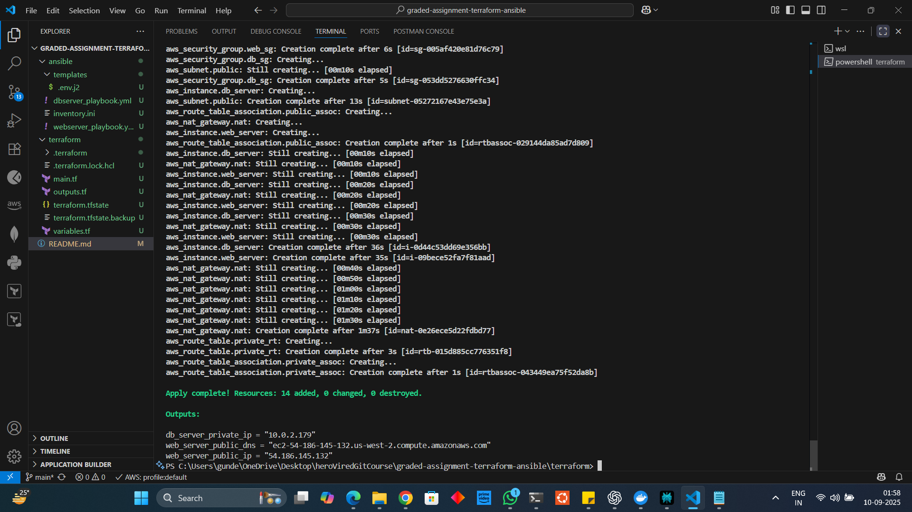
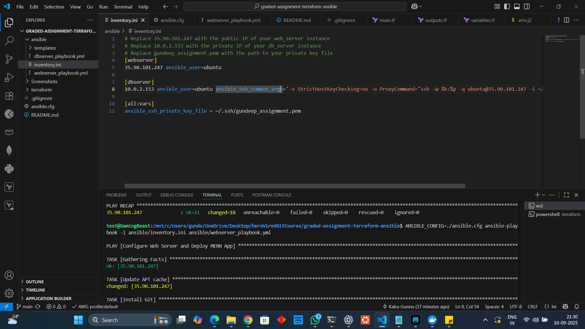

# MERN App Deployment with Terraform & Ansible


This project automates the deployment of a **MERN stack application** (MongoDB, Express, React, Node.js) onto a 2-tier architecture on **Amazon Web Services (AWS)**.

*   **Infrastructure as Code (IaC):** [**Terraform**](https://www.terraform.io/) is used to provision the entire network and compute infrastructure on AWS, including a VPC, subnets, security groups, and EC2 instances.
*   **Configuration Management:** [**Ansible**](https://www.ansible.com/) is used to configure the provisioned servers, install necessary software (Node.js, MongoDB, Nginx), and deploy the application code.

---

## 🏛️ Project Architecture

The infrastructure consists of two main components within a custom Virtual Private Cloud (VPC):

1.  **Web Server (Public Subnet):** An EC2 instance that hosts the Node.js backend and serves the React frontend via an Nginx reverse proxy. It is accessible from the internet.
2.  **Database Server (Private Subnet):** An EC2 instance running MongoDB. It is completely isolated from the internet and can only be accessed by the Web Server, ensuring the database is secure.

---

## 📂 Project Structure

```
graded-assignment-terraform-ansible/
├── ansible/
│   ├── dbserver_playbook.yml      # Playbook to configure the DB server
│   ├── webserver_playbook.yml     # Playbook to configure the web server
│   ├── inventory.ini              # Ansible inventory file
│   └── templates/                 # (Optional) Template files for configurations
│       └── .env.j2                # Environment variables for the application
├── terraform/
│   ├── main.tf                    # Main Terraform configuration
│   ├── variables.tf               # Input variables
│   └── outputs.tf                 # Output values (e.g., IPs)
├── README.md
├── ansible.config                 # Configuration to run Ansible playbooks
├── Screenshots/                   # Contains relevant screenshots at each step
└── ...
```


---

## 🚀 Getting Started

### Prerequisites

*   An **AWS Account** with programmatic access (Access Key ID and Secret Access Key).
*   An **EC2 Key Pair** generated in your AWS account to allow SSH access.
*   [**Terraform**](https://developer.hashicorp.com/terraform/downloads) installed.
*   [**Ansible**](https://docs.ansible.com/ansible/latest/installation_guide/intro_installation.html) installed.
*   Your current public IP address (you can find this by searching "what is my IP").


### Step 1: Configure AWS Credentials

Make sure your AWS credentials are set up in your environment. You can do this by setting environment variables:

```
export AWS_ACCESS_KEY_ID="YOUR_AWS_ACCESS_KEY"
export AWS_SECRET_ACCESS_KEY="YOUR_AWS_SECRET_KEY"
```

### Step 2: Provision Infrastructure with Terraform

1.  **Navigate to the Terraform directory:**
    ```
    cd terraform
    ```

2.  **Initialize Terraform:**
    This downloads the necessary provider plugins.
    ```
    terraform init
    ```
    

3.  **Plan the deployment:**
    Terraform will prompt you for your EC2 key pair name and your public IP address for SSH access.
    ```
    terraform plan
    ```
    
    

4.  **Apply the configuration:**
    This command will create all the defined resources on AWS. Confirm with `yes` when prompted.
    ```
    terraform apply
    ```

    
    
    

5.  **Get Server IPs:**
    Once the apply is complete, get the public IP of the web server and the private IP of the database server.
    ```
    terraform output
    ```
    

### Step 3: Configure and Deploy with Ansible

1.  **Update Ansible Inventory:**
    Open the `ansible/inventory.ini` file. Use the output from the previous step to update the IP addresses for the `webserver` and `dbserver`.

    

#### Note: Ensure your VS Code terminal is running Ubuntu

- **Set the default terminal profile**
    - Press Ctrl+Shift+P → Terminal: Select Default Profile → choose Ubuntu. 
- Open a new terminal. 
- **Install Ansible**
    ```
    sudo apt install ansible-core
    ```

2.  **Configure Database Server:**
    Navigate back to the project root directory. Run the `dbserver_playbook.yml`.
    ```
    cd ..
    ANSIBLE_CONFIG=./ansible.cfg ansible-playbook -i ansible/inventory.ini ansible/dbserver_playbook.yml
    ```
    This playbook installs and configures MongoDB on the private EC2 instance.

3.  **Configure Web Server & Deploy App:**
    Run the `webserver_playbook.yml`.
    ```
    ANSIBLE_CONFIG=./ansible.cfg ansible-playbook -i ansible/inventory.ini ansible/webserver_playbook.yml
    ```
    This playbook installs Node.js, Nginx, PM2, clones the MERN application code, installs dependencies, and starts the application server.

### Step 4: Access Your Application

Your MERN application is now live!

*   **Frontend:** Open your browser and navigate to the public IP of your web server.
    ```
    http://35.90.101.247 # Replace 35.90.101.247 with <WEB_SERVER_PUBLIC_IP>
    ```
*   **Backend API Endpoint (Example):** You can test a backend endpoint directly at:
    ```
    http://35.90.101.247:3001/trip # Replace 35.90.101.247 with <WEB_SERVER_PUBLIC_IP>
    ```

---

## 🧹 Cleaning Up

To avoid ongoing charges from AWS, you can destroy all the resources created by this project with a single command.

1.  Navigate to the `terraform` directory.
2.  Run the destroy command and confirm with `yes`.
    ```
    terraform destroy
    ```

This will terminate the EC2 instances and delete the VPC, subnets, and all other associated resources.
```